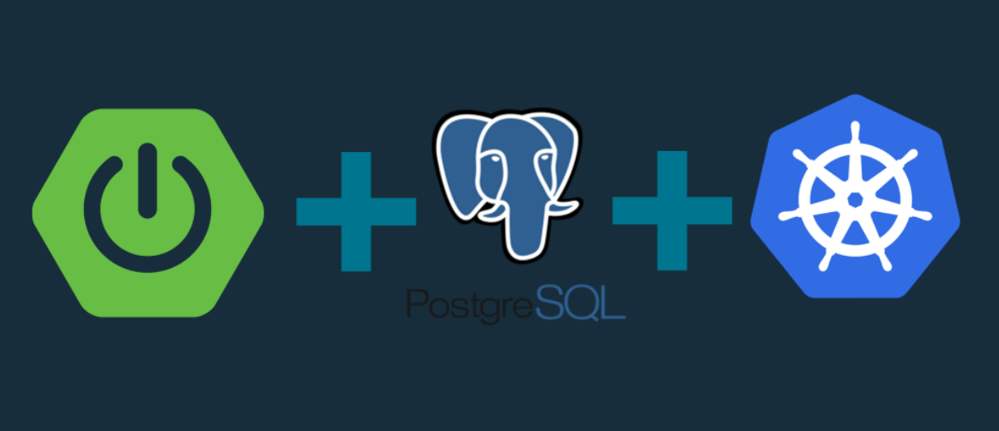
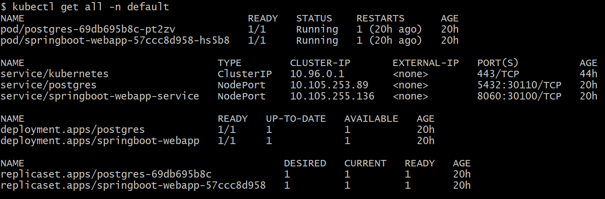
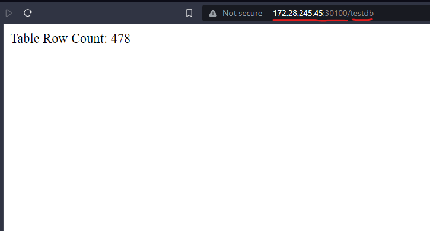

# Springboot-PostgreSQL-K8S

---

## Deps Download
- [Minikube](https://minikube.sigs.k8s.io/docs/start/)
- [Kubectl](https://kubernetes.io/docs/tasks/tools/install-kubectl-windows/)

> - I have used **HyperV** driver to create minikube K8S Cluster, So it isn't necessary to have Docker Desktop in local
> - Enable HyperVirtualization from windows Features.
> - If Windows feature wasn't there,  [Check this](https://www.xda-developers.com/how-to-install-hyper-v-windows-11-home/)

## Steps
- Start Minikube `minikube start --driver=hyperv`
- Check Status `minikube status`
- Then apply all the kustomize files
`kubectl apply -f <config.yml>`
- To access the service, needs to get the ip addrs
`minikube ip`
- And also need to tunnel the service

>  suresh@Suresh:~$ kubectl get all
  NAME                                     READY   STATUS    RESTARTS   AGE
  pod/postgres-54d8d96d58-mnlbf            1/1     Running   0          4m10s
  pod/springboot-webapp-5cf44868df-4rb68   1/1     Running   0          3m55s

  NAME                                TYPE        CLUSTER-IP    EXTERNAL-IP   PORT(S)          AGE
  service/kubernetes                  ClusterIP   10.96.0.1     <none>        443/TCP          6d21h
  service/postgres                    NodePort    10.102.40.8   <none>        5432:30110/TCP   22m
  service/springboot-webapp-service   NodePort    10.98.13.30   <none>        8060:30100/TCP   3m55s
  
  NAME                                READY   UP-TO-DATE   AVAILABLE   AGE
  deployment.apps/postgres            1/1     1            1           22m
  deployment.apps/springboot-webapp   1/1     1            1           3m55s
  
  NAME                                           DESIRED   CURRENT   READY   AGE
  replicaset.apps/postgres-54d8d96d58            1         1         1       22m
  replicaset.apps/springboot-webapp-5cf44868df   1         1         1       3m55s
  suresh@Suresh:~/Documents/cmsk/Dev_Works/kube/kubernetes-demo/src/main/resources/kustomize$ minikube service springboot-webapp
  
  ❌  Exiting due to SVC_NOT_FOUND: Service 'springboot-webapp' was not found in 'default' namespace.
  You may select another namespace by using 'minikube service springboot-webapp -n <namespace>'. Or list out all the services using 'minikube service list'
  
  suresh@Suresh:~/Documents/cmsk/Dev_Works/kube/kubernetes-demo/src/main/resources/kustomize$ minikube service springboot-webapp-service
  |-----------|---------------------------|-------------|---------------------------|
  | NAMESPACE |           NAME            | TARGET PORT |            URL            |
  |-----------|---------------------------|-------------|---------------------------|
  | default   | springboot-webapp-service |        8060 | http://192.168.49.2:30100 |
  |-----------|---------------------------|-------------|---------------------------|
  🏃  Starting tunnel for service springboot-webapp-service.
  |-----------|---------------------------|-------------|------------------------|
  | NAMESPACE |           NAME            | TARGET PORT |          URL           |
  |-----------|---------------------------|-------------|------------------------|
  | default   | springboot-webapp-service |             | http://127.0.0.1:41877 |
  |-----------|---------------------------|-------------|------------------------|
  🎉  Opening service default/springboot-webapp-service in default browser...
  ❗  Because you are using a Docker driver on linux, the terminal needs to be open to run it.
  Opening in existing browser session.
  
  suresh@Suresh:~/Documents/cmsk/Dev_Works/kube/kubernetes-demo/src/main/resources/kustomize$ minikube service postgres
  |-----------|----------|-------------|---------------------------|
  | NAMESPACE |   NAME   | TARGET PORT |            URL            |
  |-----------|----------|-------------|---------------------------|
  | default   | postgres |        5432 | http://192.168.49.2:30110 |
  |-----------|----------|-------------|---------------------------|
  🏃  Starting tunnel for service postgres.
  |-----------|----------|-------------|------------------------|
  | NAMESPACE |   NAME   | TARGET PORT |          URL           |
  |-----------|----------|-------------|------------------------|
  | default   | postgres |             | http://127.0.0.1:35365 |
  |-----------|----------|-------------|------------------------|
  🎉  Opening service default/postgres in default browser...
  ❗  Because you are using a Docker driver on linux, the terminal needs to be open to run it.
  Opening in existing browser session.
`
- Connect to postgresql db which is running on pod. Make sure u have tunnel the postgresql service before connecting
  `psql -h localhost -p 35365 -U root -d postgres`
- To access the dashboard use `minikube dashboard`

|                          |  |
|--------------------------------------------------------|-------------------------------|
|                            |  |
 
